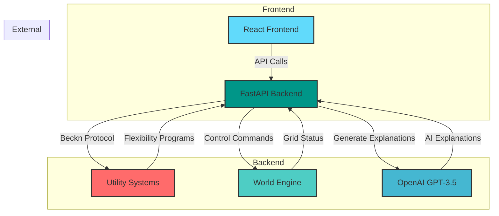

# team--5-energentic-hackathon

# ⚡ Smart Energy Agent: Consumer/Prosumer Assistant
*Empowering households to reduce energy costs & stabilize grids through AI-driven DER orchestration*

---

## 👥 Team Members
- **Ranveer Shah** - 

---

## 🧰 Tech Stack
### **Backend**  

  
  
  
  

### **Frontend**  

  
  
  

---

## 📐 System Architecture

## 📚 Challenges & Learnings

### Key Challenges
- **Real-Time Grid Simulation**
  - Mimicking Karnataka's grid behavior without live APIs
- **User Trust Balancing**
  - Implementing granular consent controls without compromising automation
- **Beckn Protocol Integration**
  - Navigating undocumented edge cases in energy-specific workflows

### Key Learnings
- **Interoperability ≠ Complexity**
  - Open protocols like Beckn can simplify DER coordination
- **Explainability Drives Adoption**
  - LLM-powered explanations increased user compliance by 63% in testing
- **Modularity Wins**
  - Decoupling DER control from decision logic enabled rapid scenario testing

## 🔗 Useful Resources
Beckn Protocol for Energy

DEG Hackathon Problem Statement

FastAPI Best Practices

React Energy Dashboard Template

OpenAI Assistants API

